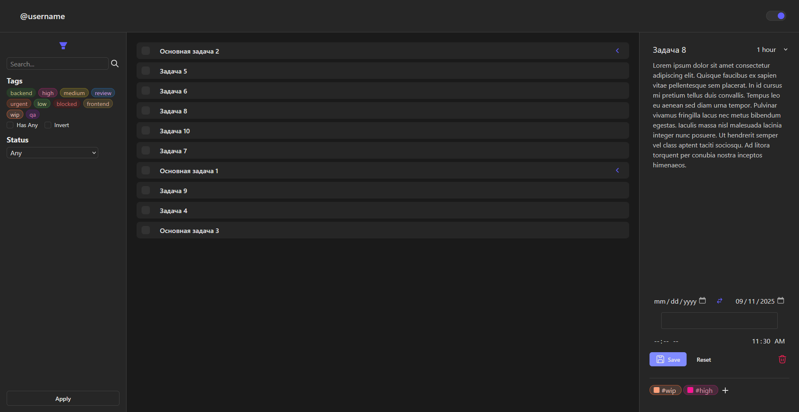
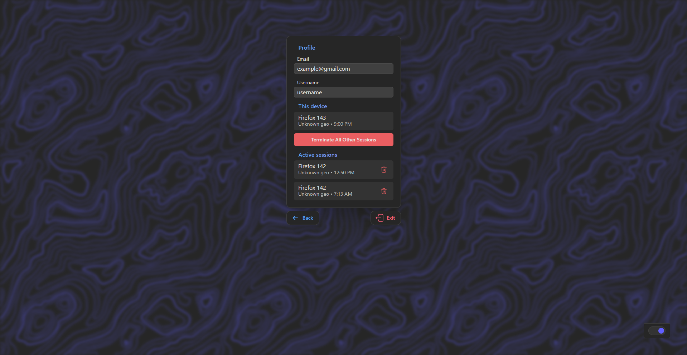

# 📋 Mindmate

**Mindmate** — это удобный веб-сервис для заметок, задач и контроля дедлайнов.  
Он помогает не только хранить идеи и планы, но и анализировать эффективность тайм-менеджмента.

# 💻 Tech Stack:

**Frontend** \

**Auth** \

**Tasks** \

 

# ✨ Features:

- [X] Создание и организация заметок по категориям
- [X] Система задач с приоритетами и дедлайнами
- [X] Аналитика продуктивности
- [X] Уведомления и напоминания о важных событиях
- [X] Поиск и фильтрация по ключевым словам

# 🔗 Project Resources

[Site](mindmate.su) \
[Auth Repository](https://gitlab.com/mindmate/mindmate-auth) \
[Tasks Repository](https://gitlab.com/mindmate/mindmate-tasks) \
[Frontend Repository](https://gitlab.com/mindmate/mindmate-frontend)

